<p align="center">

<h3 align="center">TurtlPass Firmware</h3>
<p align="center">
TurtlPass Firmware provides a simple and secure way of generating passwords using a deterministic key derivation function (HKDF) as specified in <a href="https://datatracker.ietf.org/doc/html/rfc5869">RFC 5869</a>.</p>
<p align="center">
<a href="https://github.com/TurtlPass/turtlpass-firmware-arduino/releases"></a>
</p>
<p align="center">
<a href="https://github.com/TurtlPass/turtlpass-android"></a>
<a href="https://github.com/TurtlPass/turtlpass-chrome-extension"></a>
</p>


## ⚡ Features

* Generates unique, secure passwords from a simple input hash
	* 100 characters long, including a combination of lowercase and uppercase letters, as well as numbers
* Uses a seed stored in flash memory for added security
* Automatically types the password for you, so you don't have to
* Erases the password from memory after use, for extra peace of mind
* Easy to integrate into your existing projects with USB serial port connectivity


## 🏗️ Hardware

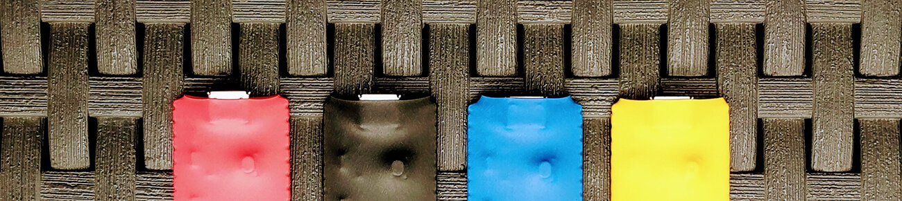

1. **Raspberry Pi Pico**
2. **OTG Cable**: micro-USB (male) to USB-C (male)
3. **Cover/Case** (optional)


## 💡 LED State

* `ON`
	* Operational (default)
* `PULSING`
	* Password ready to type
* `BLINKING`
	* Typing... (fast blink)
* `OFF`
	* No power input


## 💿 Installation and getting started

### 1. Install the Arduino Legacy IDE (1.8.19)

The Arduino IDE 1.8.19 can be downloaded from this [link](https://www.arduino.cc/en/software)

> 1.8.X version is required beforehand to ensure device drivers are installed correctly but 2.X can be used once the following steps are completed


### 2. Install the Raspberry Pi RP2040 Boards

- Open `File` -> `Preferences` -> `Settings`

- Insert the following link into the **Additional Boards Manager URLs**:

	> https://github.com/earlephilhower/arduino-pico/releases/download/global/package_rp2040_index.json

- Hit **OK** to close the dialog

<details>
  <summary>Screenshot</summary>
  
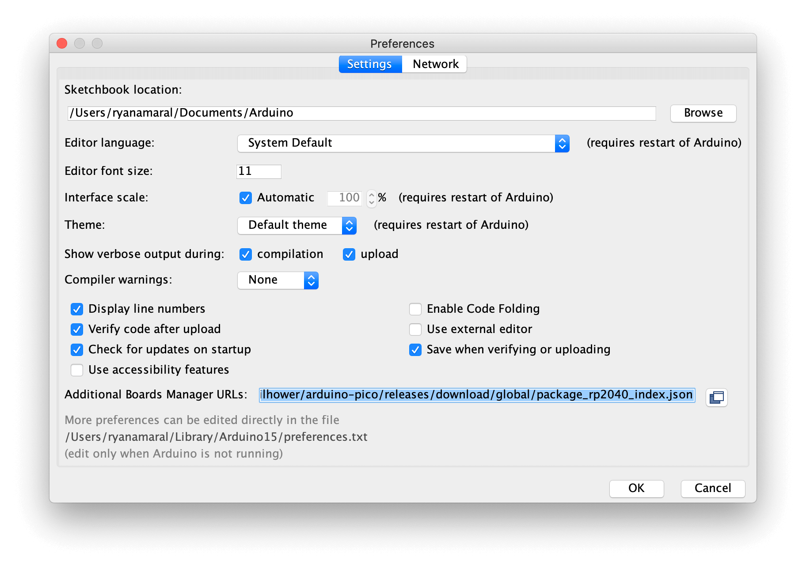
</details>


### 3. Install the Pico Board package

- Go to `Tools` -> `Board` -> `Boards Manager...`

- Search for "pico"

- Install the `Raspberry Pi Pico/RP 2040` package

<details>
  <summary>Screenshots</summary>
  
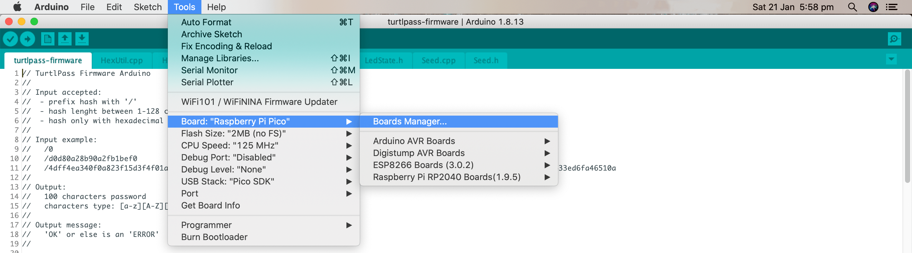
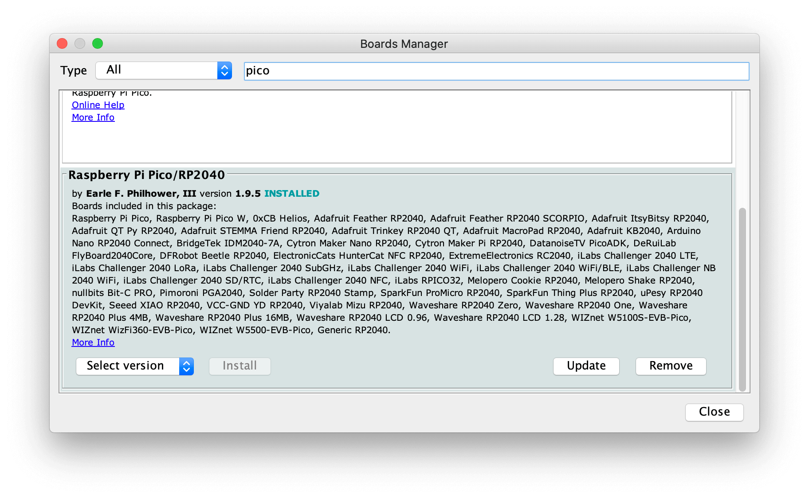
</details>


### 4. Select the Raspberry Pi Pico Board

- Go to `Tools` -> `Board` -> `Raspberry Pi RP2040 Boards(1.9.5)`

- And select `Raspberry Pi Pico`

<details>
  <summary>Screenshot</summary>
  
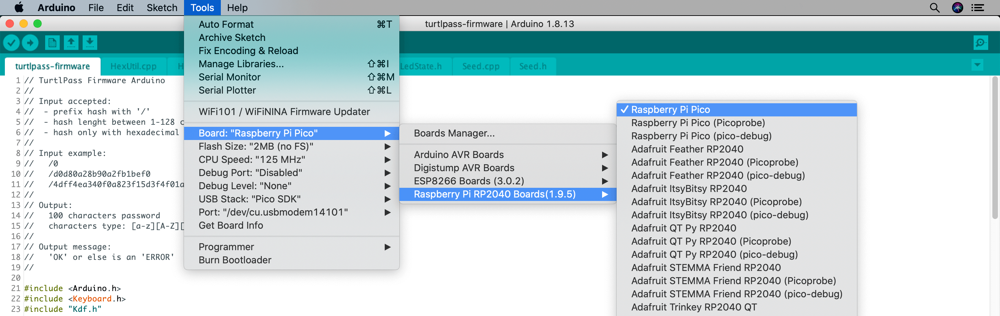
</details>


### 5. Install the Crypto library

- Go to `Tools` -> `Manage Libraries...`

- Search for "arduinolibs crypto"

- Install the `Crypto` library

<details>
  <summary>Screenshots</summary>
  
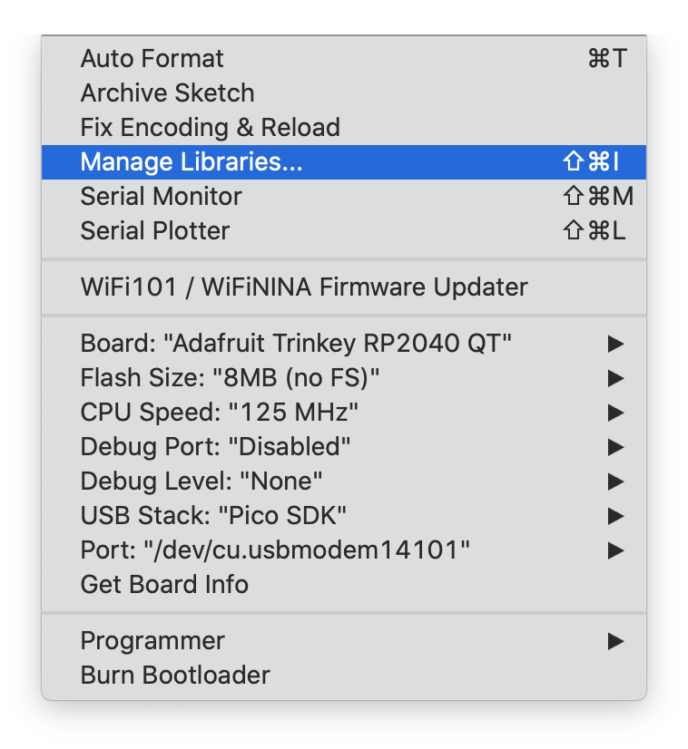
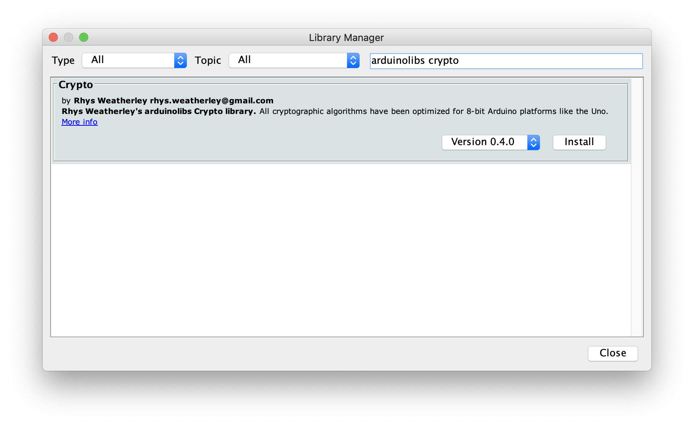
</details>


## 🔧 Generate your own seed

1. Run the bash script `./generate_seed_file.sh` to generate a new seed file `Seed.cpp.<timestamp>` on a computer with macOS or Linux.

2. Rename the generated file to `Seed.cpp`.


## ⬆️ Upload sketch

1. Open `turtlpass-firmware.ino` with Arduino IDE on a computer.

	> If the first time, select the appropriate **Board** and **Serial Port** in the Arduino menu `Tools`.

2. Connect the Raspberry Pico to a computer with a micro-USB to USB-C cable.

	> To upload your first sketch, you will need to hold the `BOOTSEL` button down while plugging in the Pico to a computer.

3. Click in the `Upload` icon to upload the sketch to the Pico

4. The sketch should be transferred and start to run.

<details>
  <summary>Screenshots</summary>
  
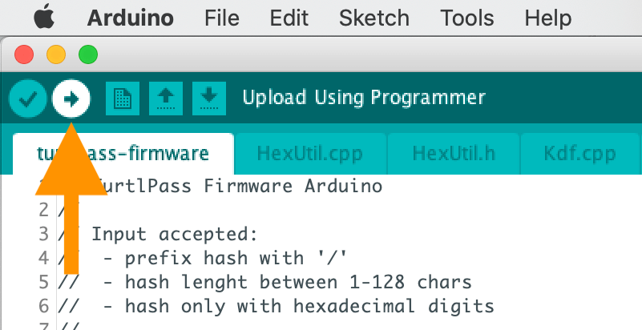
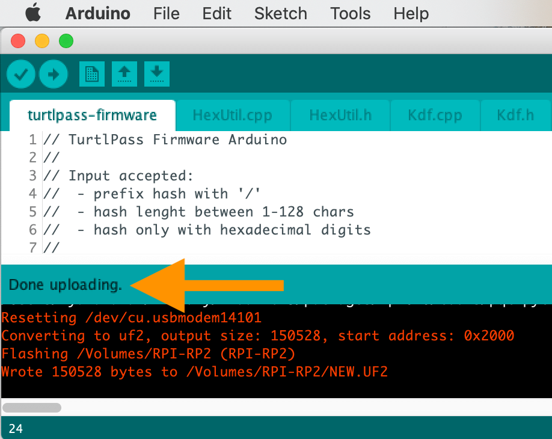
</details>


## 🐞 Debugging

1. Open the **Serial Monitor** console
	> Settings: `Newline` and `115200` baud rate

2. Type, for example, `/0` and send it

3. You should get a response saying `OK` and the LED should be `PULSING`

4. Now press the button on Pico and the password should be typed (wherever the focus is on)

<details>
  <summary>Screenshots</summary>
  
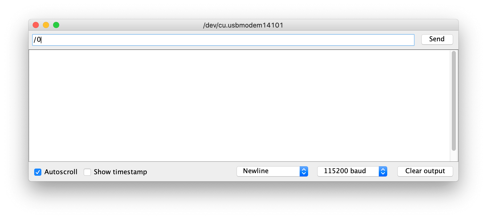
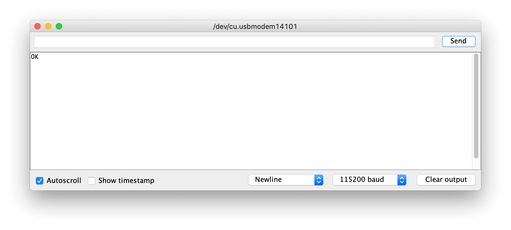
</details>


## 💾 Backup

Having multiple devices with the same seed can serve as a backup, similar to having multiple copies of your house key. One device can be kept in a secure location while another one is for daily use.

Alternatively, you can store the seed file elsewhere, but it is best to let the device store the seed offline for added security.


## 🛡️ Security

It's important to remember that if someone has physical access to the device, they may be able to compromise it with enough time and effort. However, even if the device is compromised, it is still hard to recreate the password generated by TurtlPass without access to the hash result of the inputs, such as the PIN code, app/domain, and user account, used in the client app.
  
  
<details>
  <summary>Raspberry Pi Pico</summary>
  
It is important to note that the firmware binary on the Raspberry Pi Pico RP2040 can be easily extracted using [picotool](https://github.com/raspberrypi/picotool) due to its utilization of external ROM.  
    
Example on how to do just that:

```
$ picotool save firmware.uf2
Saving file: [==============================]  100%
Wrote 369000 bytes to firmware.uf2
```
</details>

<details>
  <summary>Secure Element (SE)</summary>
  
Using a secure element such as the **ATECC608A/B** or **OPTIGA Trust X/M** for password generation can be a secure solution due to its physical tamper-resistance and isolation from the rest of the system. However, there are limitations to consider such as the difficulty in using them across multiple devices or platforms, and lack of backup or recovery options in case of loss or damage. Additionally, it may be difficult to manage and control access to the password in situations where multiple users need to access it.
</details>

<details>
  <summary>Other hardware options</summary>
  
I am continuously exploring and evaluating new hardware options for this project. As more information and resources become available, I will keep you updated on my progress.
</details>


## 📚 Libraries

* [Raspberry Pi Pico Arduino core](https://github.com/earlephilhower/arduino-pico)
	* Port of the RP2040 (Raspberry Pi Pico processor) to the Arduino ecosystem. 
	* It uses the bare Raspberry Pi Pico SDK and a custom GCC 10.3/Newlib 4.0 toolchain.
	* _LGPL 2.1 license_
* [Arduino Cryptography Library](https://github.com/rweather/arduinolibs)
	* Libraries to perform cryptography operations on Arduino devices
	* _MIT license_
* [Keyboard Library for Arduino](https://github.com/arduino-libraries/Keyboard)
	* Library allows an Arduino board with USB capabilities to act as a keyboard
	* _LGPL 3.0 license_


## 📄 License

TurtlPass Firmware is released under the [GPL 3.0 license](https://github.com/TurtlPass/turtlpass-firmware-arduino/blob/main/LICENSE).
